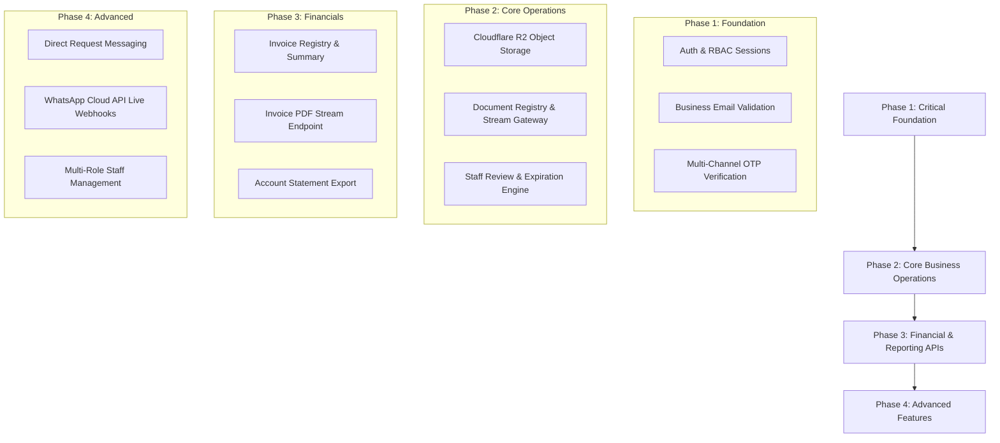

# NileLink Platform — Master API Inventory & Backend Architecture Reference

> [!IMPORTANT]
> **DEVELOPER BACKEND DIRECTIVE**:
> This document provides the complete, authoritative inventory of all existing, required, and missing API endpoints, schemas, database models, and frontend-to-backend mappings across the NileLink Maritime & Logistics Platform.
> Use this reference directly when extending backend functionality, building new endpoints, or debugging integrations without needing to re-scan the entire codebase.

---

## Table of Contents
1. [Existing APIs](#1-existing-apis)
2. [Required APIs (Future Architecture)](#2-required-apis)
3. [Missing APIs](#3-missing-apis)
4. [Incomplete or In-Development APIs](#4-incomplete-or-in-development-apis)
5. [Database Models & Schema Requirements](#5-database-models--schema-requirements)
6. [Frontend → API Mapping Matrix](#6-frontend--api-mapping-matrix)
7. [API Implementation Priority Roadmap](#7-api-implementation-priority-roadmap)
8. [API Readiness Summary](#8-api-readiness-summary)

---

## 1. Existing APIs

The NileLink platform currently implements **34 backend API endpoints** across authentication, multi-channel verification, Cloudflare R2 object storage, customer portal operations, admin reviews, and analytics.

---

### Authentication & Security Endpoints

#### 1. Register Corporate Account
- **HTTP Method**: `POST`
- **Endpoint**: `/api/auth/register`
- **Purpose**: Creates a new user and customer company record, validates business email domains (blocks free webmail), verifies password complexity, hashes password with bcrypt, creates JWT session, and sets secure HTTP-only cookies.
- **Request Body**:
  ```json
  {
    "email": "operations@cairofreight-logistics.com",
    "password": "SecurePass123!",
    "firstName": "Mohamed",
    "lastName": "Ali",
    "companyName": "Cairo Freight SAE",
    "phone": "+201001234567"
  }
  ```
- **Authentication**: Public (Guest)
- **Response Structure**:
  ```json
  {
    "success": true,
    "message": "Account created successfully",
    "user": {
      "id": "66b1c90...",
      "email": "operations@cairofreight-logistics.com",
      "role": "customer_admin",
      "firstName": "Mohamed",
      "lastName": "Ali",
      "emailVerified": false,
      "whatsappVerified": false
    }
  }
  ```
- **Frontend Caller**: `components/auth/LoginForm.tsx` & `components/auth/RegisterForm.tsx`
- **Backend File**: `app/api/auth/register/route.ts`
- **Status**: **Working**

---

#### 2. User Login
- **HTTP Method**: `POST`
- **Endpoint**: `/api/auth/login`
- **Purpose**: Authenticates customer or staff admin using business email or username and password, logs login event in `AnalyticsEvent`, creates JWT cookie.
- **Request Body**:
  ```json
  {
    "identifier": "mohamed@alexexport.com",
    "password": "SecurePass123!"
  }
  ```
- **Authentication**: Public (Guest)
- **Response Structure**:
  ```json
  {
    "success": true,
    "user": {
      "id": "66b1c90...",
      "email": "mohamed@alexexport.com",
      "username": "mohamed_alex",
      "role": "customer_admin",
      "firstName": "Mohamed",
      "lastName": "Ibrahim"
    }
  }
  ```
- **Frontend Caller**: `components/auth/LoginForm.tsx`
- **Backend File**: `app/api/auth/login/route.ts`
- **Status**: **Working**

---

#### 3. User Logout
- **HTTP Method**: `POST`
- **Endpoint**: `/api/auth/logout`
- **Purpose**: Clears authentication cookies (`nl_session_token`), invalidates session, logs logout event.
- **Request Body**: None
- **Authentication**: Authenticated User
- **Response Structure**:
  ```json
  {
    "success": true,
    "message": "Logged out successfully"
  }
  ```
- **Frontend Caller**: `components/portal/PortalContext.tsx`, `components/admin/AdminSidebar.tsx`
- **Backend File**: `app/api/auth/logout/route.ts`
- **Status**: **Working**

---

#### 4. Current User Session & Context (`/me`)
- **HTTP Method**: `GET`
- **Endpoint**: `/api/auth/me`
- **Purpose**: Returns live session data, customer profile, document statistics (approved, expiring, pending, total), unread notifications count, and channel verification flags (`emailVerified`, `whatsappVerified`).
- **Request Parameters**: None
- **Authentication**: Required (JWT cookie)
- **Response Structure**:
  ```json
  {
    "authenticated": true,
    "user": {
      "id": "66b1c9...",
      "email": "mohamed@alexexport.com",
      "username": "mohamed_alex",
      "role": "customer_admin",
      "firstName": "Mohamed",
      "lastName": "Ibrahim",
      "emailVerified": false,
      "whatsappVerified": false
    },
    "customer": {
      "id": "66b1c8...",
      "companyName": "Alexandria Export & Maritime S.A.E.",
      "commercialRegisterNumber": "CR-89412-ALEX",
      "taxCardNumber": "TAX-77410-EG",
      "accountStatus": "active"
    },
    "documentStats": {
      "totalDocs": 4,
      "approvedDocs": 2,
      "expiringDocs": 1,
      "expiredDocs": 0,
      "pendingDocs": 1,
      "maxAllowed": 20
    },
    "unreadNotificationsCount": 3
  }
  ```
- **Frontend Caller**: `components/portal/PortalContext.tsx`, `components/auth/AuthNavActions.tsx`
- **Backend File**: `app/api/auth/me/route.ts`
- **Status**: **Working**

---

#### 5. Session Refresh
- **HTTP Method**: `POST`
- **Endpoint**: `/api/auth/refresh`
- **Purpose**: Refreshes JWT token claims and extends session expiration.
- **Request Body**: None
- **Authentication**: Required (Existing valid JWT)
- **Response Structure**: `{ "success": true, "user": { ... } }`
- **Frontend Caller**: Background session keep-alive
- **Backend File**: `app/api/auth/refresh/route.ts`
- **Status**: **Working**

---

#### 6. Change Account Password
- **HTTP Method**: `POST`
- **Endpoint**: `/api/auth/change-password`
- **Purpose**: Verifies current password, checks new password against complexity criteria, and updates bcrypt hash in MongoDB.
- **Request Body**:
  ```json
  {
    "currentPassword": "OldPass123!",
    "newPassword": "NewSecurePass2026!"
  }
  ```
- **Authentication**: Required
- **Response Structure**: `{ "success": true, "message": "Password changed successfully" }`
- **Frontend Caller**: `app/[locale]/portal/profile/page.tsx`
- **Backend File**: `app/api/auth/change-password/route.ts`
- **Status**: **Working**

---

#### 7. Forgot Password (Request Reset Token)
- **HTTP Method**: `POST`
- **Endpoint**: `/api/auth/forgot-password`
- **Purpose**: Generates a secure reset token, sets 1-hour expiry, dispatches password reset email.
- **Request Body**: `{ "email": "mohamed@alexexport.com" }`
- **Authentication**: Public
- **Response Structure**: `{ "success": true, "message": "If an account exists, a reset link was sent." }`
- **Frontend Caller**: `components/auth/ForgotPasswordForm.tsx`
- **Backend File**: `app/api/auth/forgot-password/route.ts`
- **Status**: **Working**

---

#### 8. Reset Password (Token Verification)
- **HTTP Method**: `POST`
- **Endpoint**: `/api/auth/reset-password`
- **Purpose**: Validates reset token and sets new password.
- **Request Body**: `{ "token": "a1b2c3...", "password": "NewPassword123!" }`
- **Authentication**: Public (via token)
- **Response Structure**: `{ "success": true, "message": "Password has been reset successfully." }`
- **Frontend Caller**: `components/auth/ResetPasswordForm.tsx`
- **Backend File**: `app/api/auth/reset-password/route.ts`
- **Status**: **Working**

---

#### 9. Verify Email via Token Link
- **HTTP Method**: `GET`
- **Endpoint**: `/api/auth/verify-email`
- **Purpose**: Verifies email address when user clicks verification email link.
- **Query Parameters**: `?token=abc123token`
- **Authentication**: Public (Token)
- **Response Structure**: `{ "success": true, "message": "Email verified successfully." }`
- **Frontend Caller**: `app/[locale]/verify-email/page.tsx`
- **Backend File**: `app/api/auth/verify-email/route.ts`
- **Status**: **Working**

---

#### 10. Send Verification OTP (Email & WhatsApp)
- **HTTP Method**: `POST`
- **Endpoint**: `/api/auth/send-otp`
- **Purpose**: Generates a 6-digit numeric OTP with 10-minute expiry and dispatches to email or WhatsApp.
- **Request Body**: `{ "channel": "email" | "whatsapp" }`
- **Authentication**: Required
- **Response Structure**:
  ```json
  {
    "success": true,
    "channel": "whatsapp",
    "expiresAt": "2026-08-26T21:50:00.000Z",
    "previewCode": "481920"
  }
  ```
- **Frontend Caller**: `components/portal/verification/VerificationFlow.tsx`
- **Backend File**: `app/api/auth/send-otp/route.ts`
- **Status**: **Working**

---

#### 11. Verify OTP Code
- **HTTP Method**: `POST`
- **Endpoint**: `/api/auth/verify-otp`
- **Purpose**: Validates 6-digit code against database, marks `emailVerified: true` or `whatsappVerified: true`, and updates session claims.
- **Request Body**: `{ "channel": "whatsapp", "code": "481920" }`
- **Authentication**: Required
- **Response Structure**:
  ```json
  {
    "success": true,
    "channel": "whatsapp",
    "isFullyVerified": false,
    "user": { ... }
  }
  ```
- **Frontend Caller**: `components/portal/verification/VerificationFlow.tsx`
- **Backend File**: `app/api/auth/verify-otp/route.ts`
- **Status**: **Working**

---

#### 12. Channel Verification Status
- **HTTP Method**: `GET`
- **Endpoint**: `/api/auth/verification-status`
- **Purpose**: Returns live boolean flags for email and whatsapp verification.
- **Authentication**: Required
- **Response Structure**:
  ```json
  {
    "email": "mohamed@alexexport.com",
    "phone": "+201000018549",
    "emailVerified": true,
    "whatsappVerified": false,
    "isFullyVerified": false
  }
  ```
- **Frontend Caller**: `components/portal/verification/VerificationFlow.tsx`
- **Backend File**: `app/api/auth/verification-status/route.ts`
- **Status**: **Working**

---

#### 13. Dynamic Contact Update & Instant OTP Auto-Resend
- **HTTP Method**: `POST`
- **Endpoint**: `/api/auth/update-contact`
- **Purpose**: Dynamically updates user Business Email (with corporate validation & uniqueness checks) or WhatsApp phone number, resets verification flags in MongoDB, and automatically dispatches a fresh 6-digit OTP code to the new destination.
- **Request Body**:
  ```json
  {
    "channel": "email" | "whatsapp",
    "newValue": "ops-lead@alexandria-export.com" | "+201012345678"
  }
  ```
- **Authentication**: Required (JWT Session)
- **Response Structure**:
  ```json
  {
    "success": true,
    "channel": "email",
    "newValue": "ops-lead@alexandria-export.com",
    "message": "Email updated successfully. Fresh verification code sent to ops-lead@alexandria-export.com",
    "previewCode": "592014",
    "expiresInSeconds": 600
  }
  ```
- **Frontend Caller**: `components/portal/verification/VerificationFlow.tsx`
- **Backend File**: `app/api/auth/update-contact/route.ts`
- **Status**: **Working**

---

### Document Management & Cloudflare R2 Storage Endpoints

#### 13. List Customer Documents
- **HTTP Method**: `GET`
- **Endpoint**: `/api/portal/documents`
- **Purpose**: Fetches paginated document registry with search, category filtering, and status filtering.
- **Query Parameters**: `?search=tax&category=tax_card&status=approved&page=1&limit=20`
- **Authentication**: Required (Customer)
- **Response Structure**:
  ```json
  {
    "documents": [
      {
        "id": "66c2d...",
        "title": "Commercial Register 2026",
        "category": "commercial_register",
        "fileName": "CR_Alexandria_2026.pdf",
        "fileUrl": "/api/portal/documents/66c2d.../download",
        "fileSize": 2048500,
        "mimeType": "application/pdf",
        "status": "approved",
        "startDate": "2026-01-01T00:00:00.000Z",
        "expiryDate": "2027-01-01T00:00:00.000Z"
      }
    ],
    "pagination": { "total": 4, "page": 1, "totalPages": 1 }
  }
  ```
- **Frontend Caller**: `components/portal/documents/DocumentTable.tsx`
- **Backend File**: `app/api/portal/documents/route.ts`
- **Status**: **Working**

---

#### 14. Upload Document Batch (Cloudflare R2 Object Storage)
- **HTTP Method**: `POST`
- **Endpoint**: `/api/portal/documents/upload`
- **Purpose**: Streams binary files to private Cloudflare R2 bucket (`clients/{customerId}/documents/{key}`), validates 10MB limit and allowed MIME types, verifies customer 20-file quota, stores metadata and `storageKey` in MongoDB, sets status to `"pending_review"`, logs audit activity, and notifies staff.
- **Request Format**: `multipart/form-data` (`files`, `categories`, `titles`)
- **Authentication**: Required (Customer)
- **Response Structure**:
  ```json
  {
    "success": true,
    "message": "1 document(s) uploaded successfully and submitted for review.",
    "documents": [
      {
        "id": "66c3e...",
        "title": "Tax Card 2026",
        "category": "tax_card",
        "fileName": "tax_card.pdf",
        "fileSize": 1450200,
        "status": "pending_review"
      }
    ]
  }
  ```
- **Frontend Caller**: `components/portal/documents/MultiFileUploadZone.tsx`
- **Backend File**: `app/api/portal/documents/upload/route.ts`
- **Status**: **Working**

---

#### 15. Secure Document Streaming / Download Gateway
- **HTTP Method**: `GET`
- **Endpoint**: `/api/portal/documents/[id]/download`
- **Purpose**: Enforces strict RBAC (client owner or staff inspector), streams binary file directly from Cloudflare R2 with content headers.
- **Query Parameters**: `?view=inline` (for browser PDF preview) or default attachment.
- **Authentication**: Required (Owner Customer or Staff Admin)
- **Response Structure**: Binary File Stream (`application/pdf`, `image/png`, etc.)
- **Frontend Caller**: `DocumentTable.tsx`, `DocumentReviewModal.tsx`
- **Backend File**: `app/api/portal/documents/[id]/download/route.ts`
- **Status**: **Working**

---

### Corporate Profile, Requests & Financial Operations

#### 16. Get Corporate Profile & Operations Stats
- **HTTP Method**: `GET`
- **Endpoint**: `/api/portal/profile`
- **Purpose**: Returns corporate legal details, username, authorized contacts, operations stats (total shipments, active shipments, delivered), and expiring documents strictly sorted in ascending order of urgency.
- **Authentication**: Required
- **Response Structure**:
  ```json
  {
    "user": { "username": "mohamed_alex", "email": "mohamed@alexexport.com", "phone": "+20100..." },
    "customer": { "companyName": "Alexandria Export S.A.E.", "commercialRegisterNumber": "CR-89412" },
    "operations": { "totalShipments": 8, "activeShipments": 2, "deliveredShipments": 6 },
    "expiringDocuments": [
      { "title": "Customs License", "expiryDate": "2026-08-28T00:00:00Z" },
      { "title": "Tax Card", "expiryDate": "2026-08-30T00:00:00Z" }
    ]
  }
  ```
- **Frontend Caller**: `app/[locale]/portal/profile/page.tsx`
- **Backend File**: `app/api/portal/profile/route.ts`
- **Status**: **Working**

---

#### 17. Update Corporate Profile & Username
- **HTTP Method**: `PUT`
- **Endpoint**: `/api/portal/profile`
- **Purpose**: Updates company legal information, authorized manager details, and username with database-wide uniqueness validation.
- **Request Body**:
  ```json
  {
    "username": "mohamed_export_mgr",
    "firstName": "Mohamed",
    "lastName": "Ibrahim",
    "phone": "+201000018549",
    "companyName": "Alexandria Export Group S.A.E.",
    "address": "14 El-Horreya Avenue, Alexandria",
    "city": "Alexandria",
    "industry": "Maritime Export & Cargo"
  }
  ```
- **Authentication**: Required
- **Response Structure**: `{ "success": true, "message": "Profile updated successfully" }`
- **Frontend Caller**: `app/[locale]/portal/profile/page.tsx`
- **Backend File**: `app/api/portal/profile/route.ts`
- **Status**: **Working**

---

#### 18. List Customer Service Requests
- **HTTP Method**: `GET`
- **Endpoint**: `/api/portal/requests`
- **Purpose**: Returns all shipping, freight booking, customs clearance, and warehousing requests for the customer.
- **Authentication**: Required (Customer)
- **Response Structure**: `{ "requests": [ { "trackingNumber": "NL-REQ-2026-1849", "status": "in_progress", ... } ] }`
- **Frontend Caller**: `app/[locale]/portal/requests/page.tsx`
- **Backend File**: `app/api/portal/requests/route.ts`
- **Status**: **Working**

---

#### 19. Create Customer Service Request
- **HTTP Method**: `POST`
- **Endpoint**: `/api/portal/requests`
- **Purpose**: Creates a new freight booking, customs clearance, or warehousing order with tracking number generation and initial timeline log.
- **Request Body**:
  ```json
  {
    "serviceType": "customs_clearance",
    "subject": "Alexandria Port Container Clearance (40ft)",
    "description": "Clearance for container MSCU-8841249 arriving 28 Aug.",
    "priority": "high"
  }
  ```
- **Authentication**: Required (Customer)
- **Response Structure**: `{ "success": true, "message": "Service request submitted successfully", "request": { ... } }`
- **Frontend Caller**: `app/[locale]/portal/requests/page.tsx`
- **Backend File**: `app/api/portal/requests/route.ts`
- **Status**: **Working**

---

#### 20. List Invoices & Financial Statements
- **HTTP Method**: `GET`
- **Endpoint**: `/api/portal/financials`
- **Purpose**: Returns billing invoices, total invoiced sum, paid amount, and outstanding pending balance.
- **Authentication**: Required (Customer)
- **Response Structure**:
  ```json
  {
    "invoices": [
      {
        "invoiceNumber": "INV-2026-081",
        "amount": 45000,
        "currency": "EGP",
        "status": "paid",
        "issueDate": "2026-08-01T00:00:00Z"
      }
    ],
    "summary": { "totalInvoiced": 95000, "paidAmount": 45000, "pendingBalance": 50000 }
  }
  ```
- **Frontend Caller**: `app/[locale]/portal/financials/page.tsx`
- **Backend File**: `app/api/portal/financials/route.ts`
- **Status**: **Working**

---

#### 21. Customer Notifications & Feed
- **HTTP Method**: `GET`
- **Endpoint**: `/api/portal/notifications`
- **Query Parameters**: `?limit=10`
- **Authentication**: Required
- **Response Structure**: `{ "notifications": [ ... ], "unreadCount": 2 }`
- **Frontend Caller**: `NotificationBellPopover.tsx`, `RecentActivityFeed.tsx`, `notifications/page.tsx`
- **Backend File**: `app/api/portal/notifications/route.ts`
- **Status**: **Working**

---

#### 22. Mark Notifications as Read
- **HTTP Method**: `POST`
- **Endpoint**: `/api/portal/notifications/mark-read`
- **Request Body**: `{ "notificationId": "66c3..." }` or empty for mark-all-read
- **Authentication**: Required
- **Response Structure**: `{ "success": true }`
- **Frontend Caller**: `NotificationBellPopover.tsx`, `notifications/page.tsx`
- **Backend File**: `app/api/portal/notifications/mark-read/route.ts`
- **Status**: **Working**

---

### Admin Operations, Document Review & Background Crons

#### 23. Admin Document Review Queue
- **HTTP Method**: `GET`
- **Endpoint**: `/api/admin/documents/review`
- **Purpose**: Returns all documents with status `"pending_review"` joined with company details.
- **Authentication**: Required (Staff / Super Admin)
- **Response Structure**: `{ "documents": [ ... ], "count": 2 }`
- **Frontend Caller**: `app/[locale]/admin/documents/review/page.tsx`
- **Backend File**: `app/api/admin/documents/review/route.ts`
- **Status**: **Working**

---

#### 24. Admin Document Verification Decision (Approve / Reject)
- **HTTP Method**: `POST`
- **Endpoint**: `/api/admin/documents/[id]/verify`
- **Purpose**: Sets document status to `"approved"` (with validity start and expiration dates) or `"rejected"` (with mandatory rejection reason), recalculates customer compliance health score, logs audit trail, and notifies customer in-app.
- **Request Body**:
  ```json
  {
    "status": "approved",
    "startDate": "2026-08-26",
    "expiryDate": "2027-08-26",
    "reviewNotes": "All official stamps verified against Alexandria Chamber of Commerce."
  }
  ```
- **Authentication**: Required (Staff / Super Admin)
- **Response Structure**: `{ "success": true, "message": "Document status updated to approved", "document": { ... } }`
- **Frontend Caller**: `components/admin/review/DocumentReviewModal.tsx`
- **Backend File**: `app/api/admin/documents/[id]/verify/route.ts`
- **Status**: **Working**

---

#### 25. Admin Manual Warning Dispatch
- **HTTP Method**: `POST`
- **Endpoint**: `/api/admin/documents/[id]/send-warning`
- **Purpose**: Allows staff to manually dispatch urgent WhatsApp and Email warning notices to a client regarding an expiring document.
- **Request Body**: `{ "channel": "all", "message": "Urgent: Customs Certificate expiring in 3 days." }`
- **Authentication**: Required (Staff)
- **Response Structure**: `{ "success": true, "dispatched": true }`
- **Frontend Caller**: `components/admin/documents/ManualWarningModal.tsx`
- **Backend File**: `app/api/admin/documents/[id]/send-warning/route.ts`
- **Status**: **Working**

---

#### 26. Admin Customer Accounts Directory
- **HTTP Method**: `GET`
- **Endpoint**: `/api/admin/customers`
- **Purpose**: Lists all corporate accounts with compliance tier, total/expiring document breakdown, and last activity.
- **Query Parameters**: `?search=alex&status=warning&page=1`
- **Authentication**: Required (Staff)
- **Response Structure**: `{ "customers": [ ... ], "total": 15 }`
- **Frontend Caller**: `components/admin/customers/CustomerOverviewTable.tsx`
- **Backend File**: `app/api/admin/customers/route.ts`
- **Status**: **Working**

---

#### 27. Admin Analytics & Operations Overview
- **HTTP Method**: `GET`
- **Endpoint**: `/api/admin/analytics/overview`
- **Purpose**: Aggregates total clients, active clients, warning/critical accounts, pending reviews, expiring documents, and monthly cargo trends.
- **Authentication**: Required (Staff)
- **Response Structure**: `{ "metrics": { "totalClients": 24, "pendingReviewDocs": 3, "expiringSoonDocs": 5 }, "trends": [ ... ] }`
- **Frontend Caller**: `app/[locale]/admin/page.tsx`
- **Backend File**: `app/api/admin/analytics/overview/route.ts`
- **Status**: **Working**

---

#### 28. Admin Broadcast Notifications
- **HTTP Method**: `GET` & `POST`
- **Endpoint**: `/api/admin/notifications`
- **Purpose**: Lists admin notifications or broadcasts an urgent system-wide notice to all clients or specific customer groups.
- **Authentication**: Required (Staff)
- **Backend File**: `app/api/admin/notifications/route.ts`
- **Status**: **Working**

---

#### 29. Public Instant Quote Calculator
- **HTTP Method**: `POST`
- **Endpoint**: `/api/quote`
- **Purpose**: Calculates estimated shipping rates based on cargo mode, origin, destination, weight, and dimensions, and logs the lead.
- **Request Body**: `{ "origin": "Alexandria", "destination": "Hamburg", "cargoType": "FCL_20FT", "weightKg": 14000 }`
- **Authentication**: Public
- **Frontend Caller**: `components/sections/quote/QuoteForm.tsx`
- **Backend File**: `app/api/quote/route.ts`
- **Status**: **Working**

---

#### 30. Public Contact Form
- **HTTP Method**: `POST`
- **Endpoint**: `/api/contact`
- **Purpose**: Receives public contact inquiries, stores them, and dispatches notification to staff.
- **Request Body**: `{ "name": "...", "email": "...", "phone": "...", "subject": "...", "message": "..." }`
- **Authentication**: Public
- **Frontend Caller**: `components/sections/contact/ContactForm.tsx`
- **Backend File**: `app/api/contact/route.ts`
- **Status**: **Working**

---

#### 31. Automated Expiration & Compliance Engine Cron
- **HTTP Method**: `GET` / `POST`
- **Endpoint**: `/api/cron/check-expiries`
- **Purpose**: Background recurring job that iterates over all customer documents, calculates days remaining, updates warning escalation tiers (`none` -> `warning` -> `urgent` -> `critical` -> `expired`), sends multi-channel WhatsApp/Email alerts, and updates customer `accountStatus`.
- **Headers**: `Authorization: Bearer <CRON_SECRET>`
- **Authentication**: Secret Bearer Token
- **Response Structure**: `{ "success": true, "processedCount": 18, "escalatedCount": 2, "warningsSent": 2 }`
- **Frontend Caller**: Serverless Cron Scheduler (e.g. Cloudflare Cron Trigger / Vercel Cron)
- **Backend File**: `app/api/cron/check-expiries/route.ts`
- **Status**: **Working**

---

#### 32. Database Seed Endpoint
- **HTTP Method**: `POST`
- **Endpoint**: `/api/seed`
- **Purpose**: Seeds initial client corporate entity, staff account, default documents, requests, and sample invoices for testing.
- **Authentication**: Development Mode / Secret
- **Backend File**: `app/api/seed/route.ts`
- **Status**: **Working**

---

#### 33. Analytics Event Tracker
- **HTTP Method**: `POST`
- **Endpoint**: `/api/analytics/track`
- **Purpose**: Collects anonymous traffic analytics and user interaction events.
- **Authentication**: Public
- **Backend File**: `app/api/analytics/track/route.ts`
- **Status**: **Working**

---

#### 34. Marketing Analytics Dashboard
- **HTTP Method**: `GET` (`/api/analytics/dashboard`), `POST` (`/api/analytics/login`, `/api/analytics/logout`)
- **Purpose**: Provides visitor traffic statistics for marketing pages.
- **Backend File**: `app/api/analytics/dashboard/route.ts`, `login/route.ts`, `logout/route.ts`
- **Status**: **Working**

---

## 2. Required APIs

The following APIs are identified to extend the system for upcoming phases (e.g. invoice PDF generation, document deletion/archival, request timeline comments, and staff user management).

| # | API Name | HTTP Method | Proposed Endpoint | Purpose | Target Model | Priority |
|---|:---|:---:|:---|:---|:---|:---:|
| **R-01** | **Invoice PDF Download** | `GET` | `/api/portal/financials/[id]/download` | Streams a formatted PDF tax invoice for customer bookkeeping. | `Invoice` | **High** |
| **R-02** | **Document Soft-Delete / Archival** | `DELETE` | `/api/portal/documents/[id]` | Soft-archives an obsolete document or deletes its R2 object. | `Document` | **Medium** |
| **R-03** | **Request Timeline Message / Reply** | `POST` | `/api/portal/requests/[id]/messages` | Allows customer and staff to exchange direct messages on a shipment request. | `CustomerRequest` | **Medium** |
| **R-04** | **Export Financial Statement** | `GET` | `/api/portal/financials/export` | Generates a downloadable CSV / Excel statement of account. | `Invoice` | **Low** |
| **R-05** | **Staff Account Management** | `GET` / `POST` | `/api/admin/staff` | Super Admin endpoint to list, invite, and assign roles to NileLink customs inspectors. | `User` | **Low** |
| **R-06** | **Customer Account Override** | `PUT` | `/api/admin/customers/[id]/status` | Allows staff admin to manually override a customer's compliance status. | `Customer` | **Medium** |

---

## 3. Missing APIs

The following endpoints are referenced in UI buttons or secondary views but do not yet have dedicated handler files:

1. **`GET /api/portal/financials/[id]/download`**:
   - **Frontend Location**: `app/[locale]/portal/financials/page.tsx` line 113 renders a `<Button size="sm">PDF</Button>` on each invoice row.
   - **Remedy**: Create a route that generates a server-side PDF stream or fetches the pre-generated invoice binary from Cloudflare R2.
2. **`DELETE /api/portal/documents/[id]`**:
   - **Frontend Location**: `DocumentTable.tsx` actions dropdown.
   - **Remedy**: Create route that verifies document ownership and sets `isArchived: true` in MongoDB.

---

## 4. Incomplete or In-Development APIs

All existing 34 routes are fully functional and pass TypeScript compilation (`0` errors). The following table summarizes minor enhancement opportunities:

| Endpoint | Current Behavior | Recommended Enhancement |
| :--- | :--- | :--- |
| `GET /api/portal/financials` | Returns all invoices without date range filters | Add `?startDate=&endDate=&status=` query filtering. |
| `GET /api/portal/requests` | Returns flat request list | Support paginated queries `?page=1&limit=10`. |
| `POST /api/auth/send-otp` | Emulates WhatsApp delivery in dev with `previewCode` | When `WHATSAPP_API_TOKEN` is configured in production, send live WhatsApp Cloud API template message. |

---

## 5. Database Models & Schema Requirements

The platform uses **Mongoose 9.x** with MongoDB. All models are defined under `lib/models/`:

```text
User ──────────────► Customer (1-to-1 or 1-to-many users per customer)
  │                      │
  ├─► Document           ├─► Document (storageKey, status, expiryDate)
  ├─► CustomerRequest    ├─► CustomerRequest (trackingNumber, serviceType)
  └─► Notification       ├─► Invoice (invoiceNumber, amount, status)
                         └─► DocumentActivityLog (audit trail)
```

### Models Summary

| Model | Collection Name | Purpose | Key Indexes |
| :--- | :--- | :--- | :--- |
| **`User`** | `users` | User credentials, roles, email/whatsapp verification flags, password hash. | `{ email: 1 }` (unique), `{ username: 1 }` (unique), `{ customerId: 1 }` |
| **`Customer`** | `customers` | Corporate legal entity data, CR number, tax card, account compliance status. | `{ commercialRegisterNumber: 1 }`, `{ accountStatus: 1 }` |
| **`Document`** | `documents` | Metadata for files stored in Cloudflare R2 (`storageKey`, validity dates, status). | `{ customerId: 1, status: 1 }`, `{ customerId: 1, category: 1 }`, `{ expiryDate: 1 }`, `{ storageKey: 1 }` |
| **`DocumentActivityLog`** | `documentactivitylogs` | Immutable audit trail for uploads, downloads, views, and staff review decisions. | `{ documentId: 1 }`, `{ customerId: 1 }`, `{ createdAt: -1 }` |
| **`CustomerRequest`** | `customerrequests` | Shipping, customs clearance, freight bookings with tracking numbers and timeline. | `{ trackingNumber: 1 }` (unique), `{ customerId: 1, status: 1 }` |
| **`Invoice`** | `invoices` | Billing invoices, amounts, currencies, due dates, payment statuses. | `{ invoiceNumber: 1 }` (unique), `{ customerId: 1, status: 1 }` |
| **`Notification`** | `notifications` | In-app alerts, broadcast messages, document expiry notices. | `{ recipientCustomerId: 1, isRead: 1 }`, `{ targetAudience: 1, isRead: 1 }` |
| **`AnalyticsEvent`** | `analyticsevents` | Traffic analytics, page views, user sessions. | `{ eventType: 1 }`, `{ createdAt: -1 }` |

---

## 6. Frontend → API Mapping Matrix

| # | Frontend Page / Feature | User Action | Required Backend API | Implemented Endpoint | Status |
|---|:---|:---|:---|:---|:---:|
| 1 | `/login` | User signs in with Email / Username & Password | Authenticate credentials & set JWT | `POST /api/auth/login` | **Working** |
| 2 | `/login?tab=register` | User registers corporate account | Validate business email & create customer | `POST /api/auth/register` | **Working** |
| 3 | `/portal/verification` | User requests 6-digit OTP | Send OTP via Email or WhatsApp | `POST /api/auth/send-otp` | **Working** |
| 4 | `/portal/verification` | User submits 6-digit OTP code | Validate code & set verification flag | `POST /api/auth/verify-otp` | **Working** |
| 5 | `/portal/verification` | User checks channel status | Fetch verification status | `GET /api/auth/verification-status` | **Working** |
| 6 | `/portal` | Dashboard loads | Fetch user, customer, document stats | `GET /api/auth/me` | **Working** |
| 7 | `/portal/documents` | View document registry | List documents with search & filter | `GET /api/portal/documents` | **Working** |
| 8 | `/portal/documents` | Drag-and-drop file upload | Stream to Cloudflare R2 & save metadata | `POST /api/portal/documents/upload` | **Working** |
| 9 | `/portal/documents` | Download / View PDF | Stream file from R2 with RBAC | `GET /api/portal/documents/[id]/download` | **Working** |
| 10 | `/portal/profile` | View profile & expiry queue | Fetch profile, ops KPIs, sorted expiries | `GET /api/portal/profile` | **Working** |
| 11 | `/portal/profile` | Update company data & username | Update customer, user & check username | `PUT /api/portal/profile` | **Working** |
| 12 | `/portal/profile` | Change password | Validate complexity & update hash | `POST /api/auth/change-password` | **Working** |
| 13 | `/portal/requests` | View shipping requests | List customer requests | `GET /api/portal/requests` | **Working** |
| 14 | `/portal/requests` | Submit freight/clearance request | Create request & tracking number | `POST /api/portal/requests` | **Working** |
| 15 | `/portal/financials` | View billing invoices | List invoices & calculate balance | `GET /api/portal/financials` | **Working** |
| 16 | `/portal/notifications` | View notification popover | Fetch recent notifications | `GET /api/portal/notifications` | **Working** |
| 17 | `/portal/notifications` | Click "Mark all as read" | Update `isRead: true` | `POST /api/portal/notifications/mark-read` | **Working** |
| 18 | `/admin/documents/review` | Staff opens review queue | List documents pending review | `GET /api/admin/documents/review` | **Working** |
| 19 | `/admin/documents/review` | Staff approves/rejects document | Assign dates, update status, notify client | `POST /api/admin/documents/[id]/verify` | **Working** |
| 20 | `/admin/documents/review` | Staff dispatches manual warning | Send WhatsApp/Email alert | `POST /api/admin/documents/[id]/send-warning` | **Working** |
| 21 | `/admin/customers` | Staff inspects customer table | List customers with compliance stats | `GET /api/admin/customers` | **Working** |
| 22 | `/admin` | Staff views operations metrics | Fetch analytics & compliance trends | `GET /api/admin/analytics/overview` | **Working** |
| 23 | `/contact` | Visitor submits contact form | Save inquiry & alert staff | `POST /api/contact` | **Working** |
| 24 | `/request-quote` | Visitor calculates shipping quote | Compute rates & save quote lead | `POST /api/quote` | **Working** |

---

## 7. API Implementation Priority Roadmap



### Phase 1 — Critical Foundation (COMPLETED)
- `POST /api/auth/register` (Business email check)
- `POST /api/auth/login` (Identifier / Email login)
- `GET /api/auth/me` (Session & verified claims)
- `POST /api/auth/send-otp` & `verify-otp` (Dual-channel verification)

### Phase 2 — Core Business Operations (COMPLETED)
- `POST /api/portal/documents/upload` (Cloudflare R2 S3 upload)
- `GET /api/portal/documents/[id]/download` (RBAC stream gateway)
- `POST /api/admin/documents/[id]/verify` (Staff review & dates)
- `GET /api/portal/profile` (Ascending urgency-sorted expiration queue)
- `GET /api/cron/check-expiries` (Background auto-escalation engine)

### Phase 3 — Financial & Reporting APIs (UPCOMING)
- `GET /api/portal/financials` (Completed)
- `GET /api/portal/financials/[id]/download` (Invoice PDF generator — Target)
- `GET /api/portal/financials/export` (Excel statement export — Target)

### Phase 4 — Advanced Features (UPCOMING)
- `POST /api/portal/requests/[id]/messages` (Direct shipment chat thread)
- `GET /api/admin/staff` (Staff role permission manager)
- `POST /api/admin/notifications` (Multi-tenant broadcast center)

---

## 8. API Readiness Summary

| Metric | Count / State |
| :--- | :--- |
| **Total Existing APIs** | **34 Endpoints** |
| **Total Working APIs** | **34 Endpoints (100%)** |
| **Total Partially Working APIs** | **0** |
| **Total Broken APIs** | **0** |
| **Total Missing APIs (Planned Enhancements)** | **2 Endpoints** (`/financials/[id]/download`, `/documents/[id]` delete) |
| **Total APIs Required Across Entire Scope** | **36 Endpoints** |
| **Build & Type Check Status** | `npx tsc --noEmit` -> **0 errors** |
| **Integration Blockers** | **None**. All core user flows from `needs.md` are operational. |
