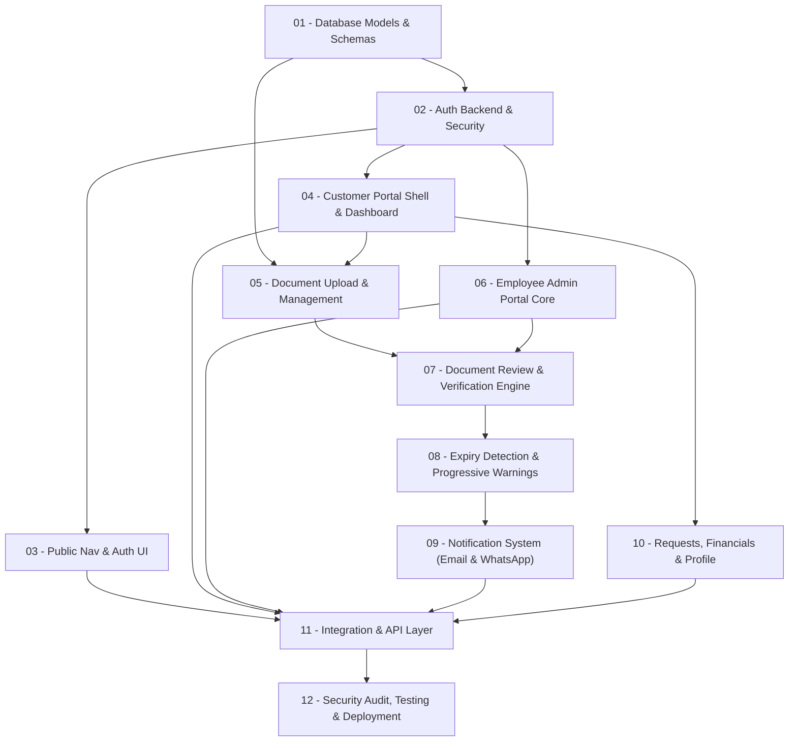

# Task 00: NileLink Portal & Document Expiry System — Architecture & Execution Overview

Status: pending
Priority: high

## 1. Original Objective & Executive Summary

The objective of this project is to build an enterprise-grade Customer Portal and Internal Employee Admin Portal for NileLink (styled after global shipping giants like CMA-CGM and MSC). The platform expands the existing corporate marketing website by introducing:

1. **Authentication & Multi-Role Security**: Robust, secure JWT session management with HTTP-only cookies, password recovery, email verification, and Role-Based Access Control (Customer, Customer Admin, Staff/Employee, Super Admin).
2. **Seamless Marketing Site Integration**: Non-intrusive login and registration entry points in the existing public navigation without altering or breaking existing marketing pages.
3. **Customer Self-Service Portal**: A modern, bilingual (Arabic RTL & English LTR), responsive dashboard allowing clients to manage corporate profiles, submit and track service requests with interactive timelines, and inspect billing/invoices.
4. **Advanced Multi-File Document Management**: A high-performance drag-and-drop document upload interface supporting up to 20 documents per account/batch with individual and aggregate progress bars, retry logic, file validation, and secure storage abstraction.
5. **Employee Verification & Review Workflow**: An internal staff management queue enabling employees to inspect uploaded documents, establish validity periods (start date & expiration date), approve or reject with mandatory notes, and track review audit trails.
6. **Dynamic Account Health Engine**: Automatic evaluation of customer standing (`Active`, `Warning`, `Inactive`) based on document compliance rules.
7. **Progressive Expiry Detection & Visual Alert System**: An automated background detection engine evaluating document expiry horizons with a 5-tier progressive escalation system (🟢 Normal >30d, 🟡 Warning 10–30d, 🟠 Urgent 3–9d, 🔴 Critical 0–2d, ⛔ Expired) featuring dynamic color badges, pulsing UI indicators, and in-portal alert banners.
8. **Multi-Channel Notification & Escalation Engine**: In-app notification center, automated 10-day advance notice + escalating reminders (10d, 7d, 3d, 1d, Expired) with anti-spam deduplication, transactional HTML emails via Nodemailer, WhatsApp Business API integration with delivery tracking, and manual staff warning dispatch with full activity audit logging.

---

## 2. Complete Scope & 46-Module Mapping

All 46 modules specified in the core blueprint (`plan.md`) are mapped across the 12 executable task files:

| Module # | Module Title | Assigned Task File |
| :--- | :--- | :--- |
| **1** | Authentication & Access Architecture | `01-database-schema-models.md`, `02-auth-backend-security.md` |
| **2** | Professional Login & Registration Entry | `03-public-navigation-auth-ui.md` |
| **3** | Login Page | `03-public-navigation-auth-ui.md` |
| **4** | Registration / Sign Up Page | `03-public-navigation-auth-ui.md` |
| **5** | Password Recovery & Account Verification | `02-auth-backend-security.md`, `03-public-navigation-auth-ui.md` |
| **6** | Authentication Backend | `02-auth-backend-security.md` |
| **7** | User & Customer Management | `01-database-schema-models.md`, `06-employee-admin-portal-core.md` |
| **8** | Roles & Permissions (RBAC) | `01-database-schema-models.md`, `02-auth-backend-security.md` |
| **9** | Customer Portal Layout | `04-customer-portal-layout-dashboard.md` |
| **10** | Customer Dashboard | `04-customer-portal-layout-dashboard.md` |
| **11** | Customer Profile & Company Profile | `10-customer-requests-financials-profile.md` |
| **12** | Customer Requests / Orders | `01-database-schema-models.md`, `10-customer-requests-financials-profile.md` |
| **13** | Documents Management | `05-customer-document-upload-management.md` |
| **14** | Financial / Payments | `10-customer-requests-financials-profile.md` |
| **15** | Notifications & Communication | `09-notification-system-email-whatsapp.md` |
| **16** | Admin Portal Core | `06-employee-admin-portal-core.md` |
| **17** | Customer ↔ Admin Workflow Synchronization | `07-document-review-verification-engine.md`, `11-portal-integration-api-layer.md` |
| **18** | Security & Access Protection | `02-auth-backend-security.md`, `12-security-audit-testing-deployment.md` |
| **19** | Responsive & Mobile Experience | `04-customer-portal-layout-dashboard.md`, `12-security-audit-testing-deployment.md` |
| **20** | Localization & Language System (AR / EN) | `03-public-navigation-auth-ui.md`, `04-customer-portal-layout-dashboard.md` |
| **21** | UX/UI Polish & Design System | `11-portal-integration-api-layer.md` |
| **22** | Integration & API Layer | `11-portal-integration-api-layer.md` |
| **23** | Testing & Authentication Security Audit | `12-security-audit-testing-deployment.md` |
| **24** | Production Readiness & Deployment | `12-security-audit-testing-deployment.md` |
| **25** | Customer Document Upload System (Up to 20 Docs) | `05-customer-document-upload-management.md` |
| **26** | Professional Multi-File Upload UX & Progress | `05-customer-document-upload-management.md` |
| **27** | Document Validation & Storage | `01-database-schema-models.md`, `05-customer-document-upload-management.md` |
| **28** | Customer Documents Dashboard | `05-customer-document-upload-management.md` |
| **29** | Employee Document Review System | `07-document-review-verification-engine.md` |
| **30** | Document Status Workflow (`Pending` → `Approved` → `Expired` → `Rejected`) | `07-document-review-verification-engine.md` |
| **31** | Employee Document Verification & Metadata | `07-document-review-verification-engine.md` |
| **32** | Customer Account Status Engine (`Active` / `Warning` / `Inactive`) | `07-document-review-verification-engine.md` |
| **33** | Document Expiry Detection Engine | `08-expiry-detection-progressive-warnings.md` |
| **34** | Employee Expiry Alerts | `06-employee-admin-portal-core.md`, `08-expiry-detection-progressive-warnings.md` |
| **35** | Customer Expiry Alerts | `04-customer-portal-layout-dashboard.md`, `08-expiry-detection-progressive-warnings.md` |
| **36** | Progressive Warning System (5 Escalation Tiers) | `08-expiry-detection-progressive-warnings.md` |
| **37** | Employee Notification Center | `09-notification-system-email-whatsapp.md` |
| **38** | Customer Notification Center | `09-notification-system-email-whatsapp.md` |
| **39** | Email Document Expiry Notifications | `09-notification-system-email-whatsapp.md` |
| **40** | Manual Employee Notification Trigger (Email / WhatsApp / Both) | `09-notification-system-email-whatsapp.md` |
| **41** | WhatsApp Notification Integration & Status Tracking | `09-notification-system-email-whatsapp.md` |
| **42** | Automated 10-Day Expiry Notification | `09-notification-system-email-whatsapp.md` |
| **43** | Notification Escalation System (10d, 7d, 3d, 1d, Expired) | `09-notification-system-email-whatsapp.md` |
| **44** | Document & Notification Activity Log | `01-database-schema-models.md`, `07-document-review-verification-engine.md` |
| **45** | Employee Customer Overview | `06-employee-admin-portal-core.md` |
| **46** | Expiry Dashboard & Analytics | `06-employee-admin-portal-core.md` |

---

## 3. Master Task List & Directory Structure

```text
tasks_6/
├── 00-overview.md                          <-- Architecture, Dependency Matrix, and Definition of Done
├── 01-database-schema-models.md            <-- MongoDB/Mongoose Data Models, Enums, Indexes, Relationships
├── 02-auth-backend-security.md             <-- Auth API Handlers, JWT, Cookie Sessions, RBAC Middleware, Rate Limiting
├── 03-public-navigation-auth-ui.md         <-- Public Nav Buttons, Login, Register, Password Recovery, Verification UI
├── 04-customer-portal-layout-dashboard.md  <-- Customer Shell, Navigation, Dashboard KPIs, Health Banner, Mobile Drawer
├── 05-customer-document-upload-management.md<-- Drag & Drop 20-File Upload, Progress Loaders, Document Management Grid
├── 06-employee-admin-portal-core.md        <-- Staff Shell, Customer Overview Table, Role Management, Analytics Dashboard
├── 07-document-review-verification-engine.md<-- Staff Review Queue, Inspection Modal, Dates Verification, Account Engine
├── 08-expiry-detection-progressive-warnings.md<-- Expiry Cron Engine, 5-Tier Progressive Warning UI, Alert Banners
├── 09-notification-system-email-whatsapp.md<-- Notification Inbox, Nodemailer Templates, WhatsApp API, Staff Dispatch
├── 10-customer-requests-financials-profile.md<-- Customer Requests Timeline, Financials/Invoices, Company Profile
├── 11-portal-integration-api-layer.md      <-- Central API Client, Optimistic Updates, Toasts, Reusable UI Tokens
└── 12-security-audit-testing-deployment.md  <-- Security Audit, RBAC Tests, 20-File Load Test, Cloudflare Production Readiness
```

---

## 4. Implementation Phasing & Dependency Graph



### Execution Phase Breakdown:
1. **Foundation Phase (Tasks 01 & 02)**: Establish complete Mongoose database models, secure session token handling with `jose`, and Next.js middleware guards.
2. **Public Entry & Authentication UI Phase (Task 03)**: Integrate non-breaking login/register entry points in marketing header/footer and build responsive authentication forms.
3. **Customer Portal & Upload Foundation (Tasks 04 & 05)**: Implement CMA-CGM style customer portal shell and the 20-file animated drag-and-drop upload component.
4. **Staff Review & Verification Engine (Tasks 06 & 07)**: Build employee customer list, document verification queue with start/expiry date setting, and automated customer status computation (`Active`/`Warning`/`Inactive`).
5. **Expiry Detection & Multi-Channel Escalation (Tasks 08 & 09)**: Deploy background expiry scanner, 5-tier progressive warning UI, automated email/WhatsApp alerts, and manual employee trigger.
6. **Customer Operations & Design System (Tasks 10 & 11)**: Build requests tracking, invoice manager, company profile, unified API client, and toast handlers.
7. **Audit, Testing & Production Readiness (Task 12)**: Perform RBAC security audits, 20-document upload stress tests, mobile touch responsiveness validation, and Cloudflare/MongoDB environment hardening.

---

## 5. Architectural & Technical Decisions

- **Framework & Runtime**: Next.js 16 (App Router) with React 19 and TypeScript.
- **Database & Persistence**: MongoDB via Mongoose with singleton connection caching in `lib/mongodb.ts`. Indexed fields on `userId`, `customerId`, `expiryDate`, `status`, and compound indexes for document filtering.
- **Session & Token Architecture**: Stateless signed JSON Web Tokens (JWT) using `jose` with HS256/RS256, stored in HTTP-only, `SameSite=Lax`, `Secure` cookies with 24-hour expiration and refresh token rotation.
- **Role-Based Access Control**:
  - `Customer`: Access restricted to own customer account, documents, requests, and invoices.
  - `Customer_Admin`: Access to manage corporate profile and delegate team members under the customer organization.
  - `Staff` / `Employee`: Full review capabilities across all customer documents, manual notification dispatch, and operational dashboard access.
  - `Super_Admin`: System configuration, employee account management, and global audit log inspection.
- **File Storage Abstraction**: Modular file storage provider supporting local filesystem storage with dedicated mime-type validation and expandable to S3 / Cloudflare R2 object storage.
- **Internationalization (i18n)**: Fully integrated with existing `next-intl` setup supporting `ar` (Arabic with native RTL layout) and `en` (English with LTR layout), with localization keys separated under portal namespaces.
- **Progressive Expiry Horizon Logic**:
  - `Normal`: `DaysRemaining > 30` (Green 🟢, badge style: `bg-emerald-500/10 text-emerald-600 border-emerald-500/20`)
  - `Warning`: `10 <= DaysRemaining <= 30` (Yellow 🟡, badge style: `bg-amber-500/10 text-amber-600 border-amber-500/20`)
  - `Urgent`: `3 <= DaysRemaining < 10` (Orange 🟠, badge style: `bg-orange-500/10 text-orange-600 border-orange-500/20`, daily reminder badge)
  - `Critical`: `0 <= DaysRemaining < 3` (Red 🔴, badge style: `bg-rose-500/10 text-rose-600 border-rose-500/20 animate-pulse`)
  - `Expired`: `DaysRemaining < 0` (Dark Red ⛔, badge style: `bg-red-950/20 text-red-500 border-red-700 font-bold`)
- **Automated Customer Account Status Calculation**:
  - `Active`: All required documents have status `Approved` and `DaysRemaining > 10`.
  - `Warning`: All required documents are `Approved`, but at least one required document has `DaysRemaining <= 10`.
  - `Inactive`: At least one required document has status `Expired`, `Rejected`, or is missing past due date.

---

## 6. Regression Safeguards & Constraints

> [!CAUTION]
> **Strict Non-Breaking Requirements**:
> 1. **Public Marketing Website**: The public landing page (`/`), services pages (`/services`), about page (`/about`), contact page (`/contact`), request-quote page (`/request-quote`), and existing analytics tracking must maintain 100% functionality and visual fidelity.
> 2. **Navbar & Footer Integrity**: Only the authenticated state check and entry links (`Login` / `Sign Up` or `Portal Dashboard` if logged in) may be injected into the public navigation. No existing links or animations may be removed or broken.
> 3. **Internationalization Integrity**: Existing locale dictionaries (`ar.json`, `en.json`, `fr.json`, etc.) must not have existing keys deleted; new namespaces (`auth`, `portal`, `admin`, `documents`) must be appended cleanly.
> 4. **Database Non-Interference**: Existing `AnalyticsEvent` collection and analytics endpoints must remain isolated and unaffected.

---

## 7. Global Definition of Done

- [ ] All 12 specialized task files in `tasks_6/` are executed and verified.
- [ ] Database models defined with indexes, relations, and TypeScript interfaces.
- [ ] Authentication API and secure session management fully functional with RBAC route protection.
- [ ] Public marketing navbar updated with responsive Login/Register buttons without layout shifts or regressions.
- [ ] Customer portal layout and dashboard operational with CMA-CGM / MSC aesthetics in Arabic RTL and English LTR.
- [ ] Multi-file upload component supports up to 20 documents with individual & aggregate progress bars, drag-and-drop, and retry capability.
- [ ] Employee document review queue allows setting start and expiry dates, approvals, rejections, and notes.
- [ ] Automated customer account health engine dynamically calculates `Active`, `Warning`, and `Inactive` status.
- [ ] Background expiry detection engine identifies expiring items and powers the 5-tier progressive warning UI.
- [ ] Automated 10-day notice, escalation schedule, transactional emails via Nodemailer, and WhatsApp API integration with status tracking are operational.
- [ ] Staff can manually dispatch expiry warnings via Email/WhatsApp with instant Activity Log auditing.
- [ ] Employee Customer Overview table and Expiry Analytics Dashboard display accurate operational metrics.
- [ ] End-to-end security audits, 20-file upload stress tests, and mobile touch verification pass successfully.
